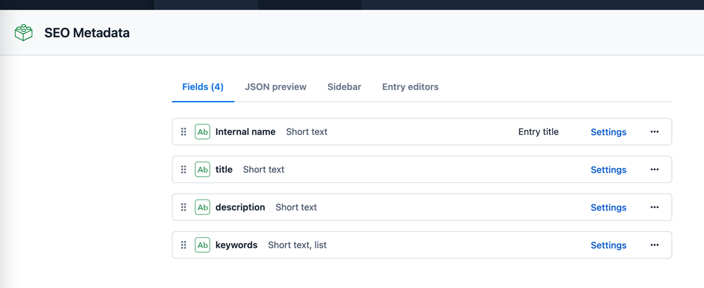

This repository was created using:
- Next.js
- Contentful -> as CMS, to write the articles
- Apollo Graphql -> to make the communication between Next.JS and Contentful.

All pages are created on build time using Next.js `getStaticPaths` and `getStaticProps` for a better performance,
and ability to scale the project using CDN.
Before we'll start, make sure you've logged in Contentful, and have already created a space.

### 1. Clone the repository
You can paste in the Terminal the following command:
```
git clone https://github.com/EliseiNicolae/Example-Contentful-Next.js-Graphql
```

After that you need to create `.env.local` file, where you'll populate them with your `Space ID` and
`Content Delivery API - access token`:

```
NEXT_PUBLIC_APP_SPACE_ID=
CONTENT_DELIVERY_API=
```

### 2. Create Content model & Content
Must have 2 content models:
- Blog Post




- SEO Metadata


### 3. Install packages
```
npm install
```


### 4. Run the project
```
npm run dev
```

For any questions, contact me on this email: nicolae.elisei1999@gmail.com
